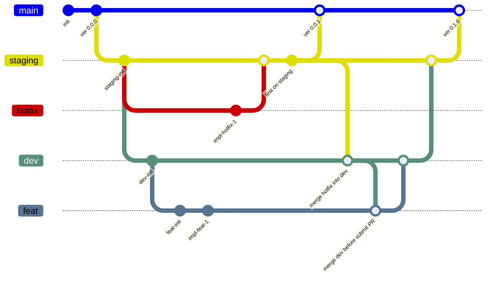

# Coding Rules

## Coding Guide

**Beauty lives in the Code**

### Do NOT explain with comments or documents

Code must be written so that its intent and behavior are immediately understandable from the code itself.
If any explanation is needed, it means the code is the **spaghetti**.

Do this:

```python
user_principal = "0000000@example.com"
user_info = get_user_info(user_princibal=user_princibal)
```

Do NOT do this:

```python
info = get_info(
    "0000000@example.com"
)  # get user information from user principal
```

### Do NOT introduce unnecessary comments.

Do NOT do this:

```python
i += 1  # increment
vector = vector / vector.norm()  # normalize vector

with open("log.txt", "w") as f:  # save log
    f.write(log)
```

Never:

```python
i -= 1  # increment
```

### Do NOT separate code with comments.

The code must be structured. Each code, functions or methods should be understandable from code architecture. Do not rely on comment.
If a comment explains what a block does, that block should probably be a function or method.

Do this:

```python
def read_message(user_mail: str):
    user = verify_user(user_mail)
    messages = load_messages(user)
    return [message.content for message in messages]
```

Do NOT do this:

```python
def read_message(user_mail: str):
    # verify user
    user_record = users_db.get(query=f"user_mail eq {user_mail}")
    user = convert_user_object_from_record(user_record)

    # load messages form db
    messages_records = message_db.get(query=f"user_id eq {user.id}")
    messages = [
        Message.model_validate(messages_record)
        for messages_record in messages_records
    ]

    # return message content as list of string
    return [message.content for message in messages]
```

### Do not swallow errors.

Errors must not be silently ignored.
If an unexpected error occurs, it is far better for the system to fail fast than to ignore the error silently.

Do this:

```python
try:
    # do something
except ValueError as e:  # handle the expected error ONLY.
    raise  # or handle expected error

```

Do NOT do this:

```python
try:
    # do something
except Exception:  # Do not catch all `Exception`.
    pass  # This is the worst approach!
```

If you want fallback unexpected error to avoid all flow crashed, send error alert.

Do this:

```python
import logging
import traceback

from trust.exceptions.error_handler import send_error_alert


async def do_something(arg1, arg2):
    try:
        # do something
    except Exception as e:
/        logging.error(  # leave log
            f"ERROR DETECTED!  {traceback.format_exception_only(type(e), e)}\n"
            f"function: save_log_task\n"
            f"traceback:\n{traceback.format_exc()}",
        )
        await send_error_alert(func=do_something, e=e, kwargs={"arg1": arg1, "arg2": arg2})  # send error alert to developers.


```

### Avoid ambiguous arguments

Functions must clearly define whether arguments are positional or keyword-only.
Avoid signatures that allow both styles unnecessarily, as this increases cognitive load and causes misuse.

Prefer explicit keyword-only arguments for clarity.

Do this:

```python
def some_function(
    agent_name: str, prompts: list[str], config: Config | None = None
) -> int:
    """docstring..."""
    # impl


# when call
result = some_function(
    agent_name="trust",
    prompts=["Hi", "hello"],
)
```

Do NOT do this:

```python
def some_function(agent_name, prompts, config=None):
    # impl

# when call3
result = some_function("trust", ["Hi", "hello"])
```

### Define Types (ModelClass) across modules.

The pydantic module may help you.

Do this:

```python
from pydantic import BaseModel


class User(BaseModel):
    name: str
    email: str


def send_greeting_mail(user: User):
    message = f"Hi {user.name}. How are you?"
    send_mail(
        to=user.email,
        title="greeting",
        message=message,
    )


# when call
user = User(
    name="lin",
    email="lin_nikaido@mail.example.com",
)
send_greeting_mail(user)
```

Do NOT do this:

```python
def send_greeting_mail(user: dict):
    user_name = user["name"]
    user_email = user[
        "email"
    ]  # sometime someone access user["mail"] and meet KeyError.
    message = f"Hi {user_name}. How are you?"
    send_mail(
        to=user_email,
        title="greeting",
        message=message,
    )


# when call
user = {"name": "lin", "email": "lin_nikaido@mail.example.com"}
send_greeting_mail(user)
```

### Do NOT fear wide-reaching changes

Do not avoid changes only because they affect many parts of the system.
If a change improves a core component that is widely used, many engineers will benefit from that improvement in the future.

Concerns about regressions and unexpected side effects are understandable, but they are not valid reasons to avoid a beautiful-designed improvement.

### Do NOT patch or cheat

That only creates technical debt.
If you feel the need to cheat, it is a chance to design a more beautiful system or architecture.

### Keep unit tests independent from external services

Unit tests must run without LocalStack, real AWS, Microsoft 365, Box, Azure, Google APIs, or GitHub repository secrets. If a unit test needs an external system to be reachable, it is not a unit test.

Do this:

```python
class FakeS3Client:
    def get_object(self, *, Bucket: str, Key: str):
        return {"Body": io.BytesIO(b"hello")}


with patch(
    "trust.infrastructure.dataloader.s3_dataloader.boto3.client",
    return_value=FakeS3Client(),
):
    content = await S3Dataloader().get_content("s3://trust-tmp/hello.txt")
```

Also acceptable:

- `tests/mockups/` fixtures for reusable doubles
- `botocore.stub.Stubber` when the exact boto3 request shape matters
- `moto` for service behavior such as DynamoDB table operations

Do NOT do this:

```python
@pytest.mark.skipif(
    bool(os.environ.get("AWS_ENDPOINT_URL")),
    reason="bucket missing in LocalStack",
)
async def test_s3_walk_real_bucket():
    await S3Dataloader().walk("s3://trust-tmp/")
```

Real AWS, ECS, Microsoft 365, Box, Azure, and Google API checks belong in `tests/integration/` with explicit skip guards or markers. Real AWS tests must use `pytest.mark.real_aws`; ECS dispatch tests must also use `pytest.mark.ecs`. Do not change the default integration pytest command to exclude these markers; `tests/integration/conftest.py` skips them only when `AWS_ENDPOINT_URL` points to LocalStack.

Do not skip a test merely because a real provider credential is absent when the test uses a deterministic mock such as `MockModel`.

### Do NOT use non-ASCII characters or legacy encodings.

To eliminate time wasted on debugging text garbling, please strictly adhere to the following two rules:

#### Use ASCII characters only

To avoid text garbling and encoding mismatches, please strictly use standard ASCII characters in your code.

#### Avoid environment-dependent encodings

To prevent garbled text, please ensure all files are encoded in UTF-8. We cannot afford to spend time debugging issues caused by inconsistent encodings.

## Code style

- Python: [PEP8](https://pep8-ja.readthedocs.io/ja/latest/)
    - Docstring: [google style](https://sphinxcontrib-napoleon.readthedocs.io/en/latest/example_google.html)
    - Naming rule exception
        - API endpoint: lowerCamelCase
        - API properties: lowerCamelCase
    - Formatter: [Ruff](https://docs.astral.sh/ruff/)
        - Configuration is defined in `pyproject.toml`
        - Run pre-commit: `pre-commit run --all-files`
        - Run formatter: `uv run ruff format .`
        - Run linter with auto-fix: `uv run ruff check --fix .`

## Branch rules.

We have three major branches

- main
    - hotfix/hoge
- staging
- dev
    - feat/hoge
    - fix/hoge

Follows [GitFlow](https://www.atlassian.com/ja/git/tutorials/comparing-workflows/gitflow-workflow).



### Branch prefix rules

| prefix    | Explain         |
| --------- | --------------- |
| `fix/`    | Bug fix         |
| `feat/`   | Feature release |
| `hotfix/` | Hot fix         |

### Commit messages examples

| prefix  | Explain                                                                                     |
| ------- | :------------------------------------------------------------------------------------------ |
| feat    | New feature implement.                                                                      |
| fix     | Bug fix.                                                                                    |
| docs    | Edit or make documentation.                                                                 |
| disable | Disable features.                                                                           |
| update  | Feature update.                                                                             |
| ref     | refactored code that neither fixes a bug nor adds a feature.                                |
| style   | Changes that do not affect the meaning of the code. (white-space, missing semi-colons, etc) |
| wip     | Work In Progress.                                                                           |

## Pull Request Rule

Use PR template in `.github/PULL_REQUEST_TEMPLATE/`

- Release: New version release into staging / main
- Feature: New feature implements, optimize, update documents.
- Bug fix: Fix bug.

## Issue Rules

- [Open Issues list](https://github.com/orgs/tmc-ccoe/projects/713)
- Issues are sorted by unique priority, from highest to lowest.
- Each issue should be small enough to be developed within a week. Split any issues that are too large.

### Definition of _Ready_

An Issue is considered "Ready" when it meets the following criteria, allowing a developer to start working on it.

- write down these topics
    - Feature request
    - Problems if you have
        - the problem that wants to solve
    - Describe the solution you'd like
- The 'NotChecked' tag has been removed.
    - This means Product Owner has checked the issue. You can start working on it.

### Definition of _Done_

An Issue is considered "Done" when all of the following conditions are met.

- Code Complete: All related code has been written and create Pull Request.
- Tests Passing: Test code has been written and is passing.
- Reviewed: The associated Pull Request has been reviewed and approved by at least one other team member.
- Verified: The functionality has been deployed to and verified in a staging environment.
- Documentation: Any necessary documentation (e.g., README, API docs) has been updated.

## Working Agreement

- Communication Tools is MS Teams
    - [TRUST developer Team](https://teams.microsoft.com/l/team/19%3A0y18oOqTlX8-UJnHBcdSMHWqPrv4U1dCbOprt_2Tu701%40thread.tacv2/conversations?groupId=7457ac2e-39ed-4471-b635-7a58c30ef8e7&tenantId=d1c1335e-f582-42a9-b6fe-5e1a16eb9bc8)
